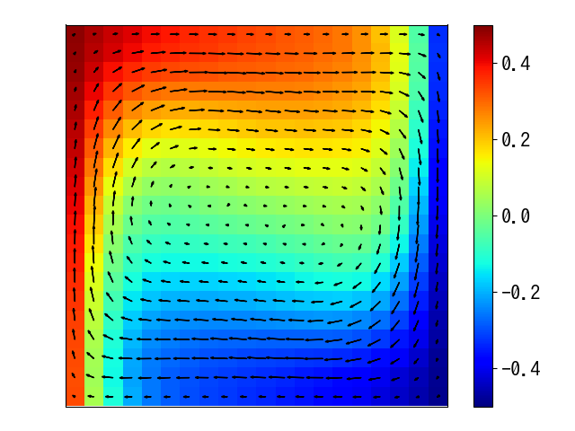
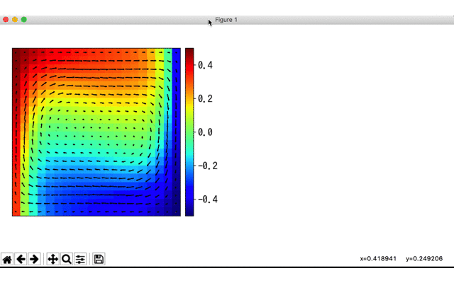

## Infomation
- 可視化ツールのスクリプト

  ```
  plot.py: UVT.DAT から pdf と png を生成
  make_gif.py: 複数のDATファイルから gif を生成
  show_average.py: DATファイルの温度分布を表示し、任意の範囲の平均値を見ることができます
  ```

- 環境導入用のテキストファイル

  ```
  requirements.txt: 依存環境の一覧
  ```

  

## Requirements

- Python 3
- Numpy
- Matplotlib
- Pillow
- Animatplot

Python 3の導入方法は各自調べてください。

pipが入っているなら、

```shell
$ pip install -r requirements.txt
もしくは
$ pip3 install -r requirements.txt
```

で導入してください。


## Usage（使い方）

DATファイルがあるディレクトリに `plot.py` と `make_gif.py` をコピーし、以下を参考に。

- 1つのDATファイルから画像ファイルを作成

```shell
# 例として、UVT.datがある場合

# dat -> png, pdf
$ python plot.py
# UVT.png と UVR.pdf が 作られます。

# hoge.datを処理する場合
$ python plot.py hoge.dat
```

- 複数のDATファイルからGIF画像を作成

```shell
# 例として、out_020.dat, out_040.dat, out_060.dat, out_080.dat, out_100.datがある場合

# datfiles -> gif
$ python make_gif.py "out*.dat"
# sample.gif が作られます

# ファイル名を変える場合
$ python make_gif.py "out*.dat" -o hoge.gif
# hoge.gif が作られます

# fpsを30に変更する（初期は fps = 10）
$ python make_gif.py "out*.dat" --fps 30

# datfiles -> 温度の時間経過を取る
$ python make_gif.py "out*.dat" -mt
# GUIが立ち上がるので、平均を取りたい範囲を2クリックで選択してください。
# さらに1クリックで生成が始まります。
# やり直したい場合は、1右クリックでやり直せます
# average_temp.gif が作られます。

# ファイル名を変える場合
$ python make_gif.py "out*.dat" -mt -mto fuga.gif
# fuga.gif が作られます。
```

- DATファイルを可視化して温度分布の平均値を調べる

```shell
# 例として、UVT.datがある場合

$ python show_average.py UVT.dat
# こちらはドラッグで範囲選択ができます。

# 矢印の色を変更する場合
$ python show_average.py UVT.dat -ac gray
# 矢印の色が灰色になります。

# 温度の最小値と最大値を変更する場合
$ python show_average.py UVT.dat --vmin 0 --vmax 1
# 初期値は -0.5 〜 0.5 です

# もっと高解像度で検証したい場合
$ python show_average.py UVT.dat --dpi 150
# 初期値は 100 です。
```


## Examples

- DAT -> PNG



- DAT -> PDF


- DATs -> GIF


- DATs -> GIF (T Average)


- Show average




